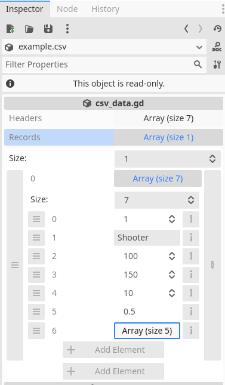
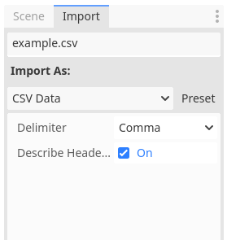

# Godot CSV Typed Importer

Using CSV files as game data configuration tables in Godot is inspired by the [godot-csv-data-importer](https://github.com/timothyqiu/godot-csv-data-importer) library. The core parsing section has been updated to use type-defined parsing. The specific configuration usage is as follows.

```gdscript
func _ready():
    var example = preload("res://assets/example.csv")
    var shooter = example.fetch(1)#fetch row data by primary key, here is 1
    print(shooter)
    #{ "id": 1, "name": "Shooter", "speed": 100, "max_speed": 150, " damage": 10, " crit": 0.5, "items": [1, 1, 2, { "foo": 1, "bar": 2 }, "test"] }
```

### Example.csv


| CharacterConfig | Name    | Speed | MaxSpeed  | Damag  | Crit  | Items                             |
|-----------------|---------|-------|-----------|--------|-------|-----------------------------------|
| id              | name    | speed | max_speed | damage | crit  | items                             |
| int             | str     | int   | int       | int    | float | json                              |
| 1               | Shooter | 100   | 150       | 10     | 0.5   | [1,1,2,{"foo":1, "bar":2},"test"] |

  - The first line is a description line and will not be included in data export. It is enabled by default. If not needed, please uncheck this option during import.
  - The second line is the name of the data field.
  - The third line is the definition of data type, currently supporting four formats: int, float, str, and json. Under the json format, it is possible to input a combination of dictionaries and arrays in addition to the other three formats. Please feel free to experiment with more complex nesting.

### Screenshot display
 

### Thanks
[timothyqiu/godot-csv-data-importer](https://github.com/timothyqiu/godot-csv-data-importer)
